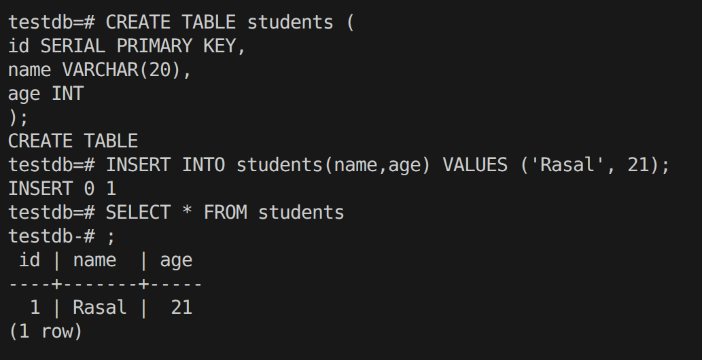

# ShaktiDB Installation Notes

Install and configure ShaktiDB on Ubuntu 22.04 LTS system.

---

## System Information

| Field            | Value            |
|------------------|------------------|
| **Username**     | Rasal            |
| **OS**           | Ubuntu 22.04 LTS |
| **Architecture** | x86_64           |

---

## Workspace Structure

```text
shaktidb-work/
├── installation
├── scripts
├── reports
├── bugs
├── docs
└── app-project
```

### Installation Folder

`~/Documents/shaktidb-work/installation`

### Downloaded Package

`shaktidb_17.7.1.1_amd64.deb`

---

## Installation Steps

### Step 1 — Navigate to Installation Directory

```bash
cd ~/Documents/shaktidb-work/installation
```

### Step 2 — Install Required Dependencies

```bash
sudo apt update
sudo apt install -y \
  build-essential \
  git \
  curl \
  wget \
  perl \
  libreadline-dev \
  zlib1g-dev \
  openssl \
  libssl-dev
```

### Step 3 — Install ShaktiDB

```bash
sudo dpkg -i shaktidb_17.7.1.1_amd64.deb
```

### Step 4 — Fix Broken Dependencies

```bash
sudo apt --fix-broken install
```

Then reinstall:

```bash
sudo dpkg -i shaktidb_17.7.1.1_amd64.deb
```

### Step 5 — Verify Installation

```bash
ls /usr/lib/postgresql/
```

Expected output:

```
17.7.1.1
```

Verify binaries:

```bash
ls /usr/lib/postgresql/17.7.1.1/bin
```

### Step 6 — Create postgres User

Check user:

```bash
id postgres
```

If user does not exist:

```bash
sudo adduser postgres
```

Grant permissions:

```bash
sudo usermod -aG sudo postgres
```

### Step 7 — Configure Environment Variables

Switch to postgres user:

```bash
sudo su - postgres
```

Verify:

```bash
whoami
```

Expected:

```
postgres
```

Create `.bash_profile`:

```bash
touch ~/.bash_profile
```

Open file:

```bash
nano ~/.bash_profile
```

Add:

```bash
export PATH=/usr/lib/postgresql/17.7.1.1/bin:$PATH
```

Reload:

```bash
source ~/.bash_profile
```

Verify:

```bash
which initdb
```

Expected:

```
/usr/lib/postgresql/17.7.1.1/bin/initdb
```

### Step 8 — Create Data Directory

Exit postgres user:

```bash
exit
```

Create database storage:

```bash
sudo mkdir -p /data/sdb
```

Assign ownership:

```bash
sudo chown -R postgres:postgres /data/sdb
```

Set permissions:

```bash
sudo chmod 700 /data/sdb
```

Verify:

```bash
ls -ld /data/sdb
```

Expected:

```
drwx------ postgres postgres
```

### Step 9 — Initialize Database Cluster

Switch back:

```bash
sudo su - postgres
```

Initialize cluster:

```bash
initdb -D /data/sdb --no-ssl
```

Expected:

- system database creation
- `pg_hba.conf` creation
- `postgresql.conf` creation

### Step 10 — Configure PostgreSQL

Open config:

```bash
nano /data/sdb/postgresql.conf
```

Modify:

```
port = 5433
listen_addresses = '*'
```

Save file.

### Step 11 — Configure Authentication

Open:

```bash
nano /data/sdb/pg_hba.conf
```

Add:

```
local   all   all                 trust
host    all   all   127.0.0.1/32  trust
```

Save file.

### Step 12 — Start ShaktiDB Server

```bash
pg_ctl -D /data/sdb -l /data/sdb/logfile start
```

Expected:

```
server started
```

### Step 13 — Verify Running Processes

```bash
ps aux | grep postgres
```

Expected:

- postgres processes running
- background workers visible

### Step 14 — Connect to Database

```bash
psql -p 5433 -U postgres -d postgres
```

Expected:

```
postgres=#
```

### Step 15 — Create Test Database

```sql
CREATE DATABASE testdb;
```

List databases:

```
\l
```

Connect:

```
\c testdb
```

### Step 16 — Create Test Table

```sql
CREATE TABLE students (
    id SERIAL PRIMARY KEY,
    name VARCHAR(100),
    age INT
);
```

### Step 17 — Insert Test Data

```sql
INSERT INTO students(name, age)
VALUES ('Rasal', 21);
```

### Step 18 — Read Data

```sql
SELECT * FROM students;
```

Expected:

```
 id | name  | age
----+-------+-----
  1 | Rasal | 21
```

### Step 19 — Exit Database

```
\q
```

### Step 20 — Shutdown Server

```bash
pg_ctl -D /data/sdb stop
```

Expected:

```
server stopped
```

---

## Problems Faced

### Problem 1

Permission denied while creating `.bash_profile`

**Solution:** Fixed ownership using:

```bash
sudo chown -R postgres:postgres /var/lib/postgresql
```

### Problem 2

postgres user not in sudoers file

**Solution:** Executed system-level commands using normal user account with sudo privileges.

---

## Important Configuration Files

| File                  | Path                         |
|-----------------------|------------------------------|
| PostgreSQL Main Config | `/data/sdb/postgresql.conf` |
| Authentication Config  | `/data/sdb/pg_hba.conf`     |

---

## Important Commands

| Action            | Command                                          |
|-------------------|--------------------------------------------------|
| Start Server      | `pg_ctl -D /data/sdb -l /data/sdb/logfile start` |
| Stop Server       | `pg_ctl -D /data/sdb stop`                       |
| Connect Database  | `psql -p 5433 -U postgres -d postgres`           |

---

## Current Status (Completed)

- ShaktiDB Installed Successfully
- Database Cluster Initialized
- Server Started Successfully
- Test Database Created
- Table Operations Verified
- Installation Completed

## Screenshots
